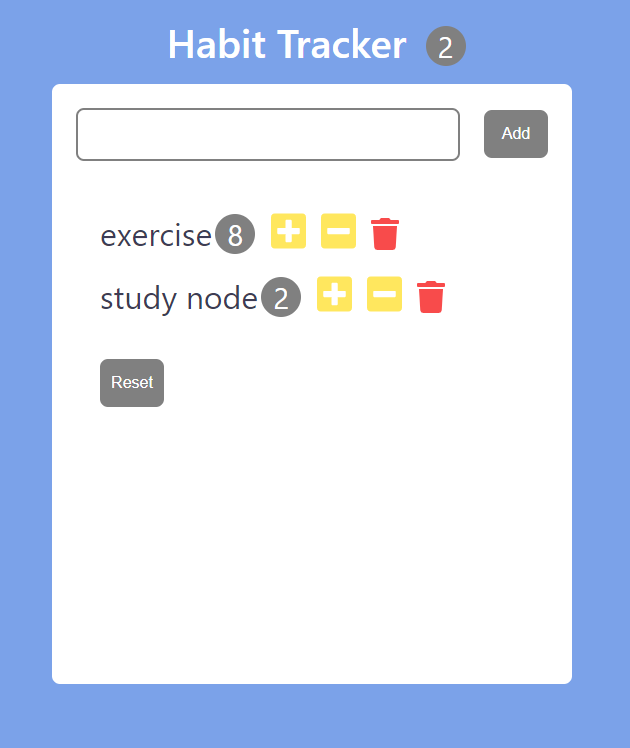

# 202112711 윤솔비

## 캡쳐화면

## 실행

    yarn start

## 테이블

habit

- id : int, primary key
- name : char(100)
- count : int

## API 설계

| Method |        URL        |         Content |
| ------ | :---------------: | --------------: |
| GET    |      /habit       | 모든 habit 조회 |
| POST   |   /habit/insert   |      habit 추가 |
| DELETE |    /habit/:id     |      habit 삭제 |
| POST   | /habit/update/:id |  count 업데이트 |
